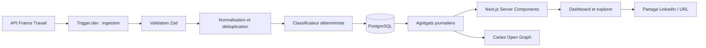

# Junior, vraiment ?

> **Le marché tech junior, mesuré plutôt que raconté.**

**Junior, vraiment ?** est un observatoire public et indépendant du marché de l'emploi tech junior en France. Il transforme des offres d'emploi officielles et actualisées en indicateurs simples, vérifiables et partageables.

La question fondatrice est volontairement directe :

> **Parmi les offres qui se présentent comme « junior », combien exigent déjà deux ans d'expérience ou plus ?**

Le produit ne cherche pas à devenir un nouveau site d'emploi. Il mesure les conditions réellement demandées, montre les contradictions éventuelles et donne accès aux offres et aux phrases qui justifient chaque classement.

---

## Statut du dossier

| Élément | Valeur |
|---|---|
| Version de la documentation | `1.0.0` |
| Date de référence technique | `2 septembre 2026` |
| État | MVP implémenté ; validation du lancement public en cours — voir `docs/18-OPERATIONS-VALIDATION.md` |
| Langue du produit | Français |
| Zone couverte au lancement | France métropolitaine et DROM lorsque la source le permet |
| Source principale prévue | API Offres d'emploi de France Travail |
| Maquette | Références intégrées, inventoriées dans [`/maquette`](./maquette/INVENTORY.md) |

Cette archive contient les spécifications produit, techniques, UX, données, sécurité, tests, exploitation et diffusion nécessaires pour qu'un développeur puisse construire le MVP sans devoir réinventer les décisions importantes.

---

## Proposition de valeur

### Pour un candidat junior

Comprendre rapidement :

- si les offres correspondant à son métier sont réellement accessibles ;
- combien d'années d'expérience sont demandées ;
- quelles technologies reviennent le plus ;
- quels employeurs publient un salaire ;
- comment la situation évolue dans sa ville ou sa région.

### Pour un recruteur ou une entreprise

Comparer une annonce à des pratiques observées sur le marché et repérer les formulations contradictoires qui réduisent la crédibilité d'une offre.

### Pour les écoles, médias et professionnels de la tech

Disposer de chiffres datés, reproductibles et partageables plutôt que d'impressions isolées.

---

## Principe de confiance

Aucun chiffre principal ne doit être une « opinion de l'algorithme ».

Pour toute offre classée comme **junior contradictoire**, le produit conserve et affiche :

1. la ou les phrases qui présentent l'offre comme junior ;
2. la ou les phrases ou données qui imposent une expérience minimale ;
3. les règles déterministes déclenchées ;
4. la version du classificateur ;
5. la date de collecte et la source.

Une offre ambiguë n'est pas forcée dans une catégorie. Elle reçoit le statut `ambiguous`, visible dans la méthodologie et exclue du dénominateur principal lorsque son inclusion fausserait le résultat.

---

## Périmètre du MVP

Le MVP doit fournir cinq expériences complètes :

1. **Comprendre le chiffre principal** sur la page d'accueil.
2. **Filtrer** par famille de métier, technologie et territoire.
3. **Explorer les offres** qui composent un indicateur.
4. **Vérifier la preuve** ayant produit chaque classement.
5. **Partager un insight** avec une URL et une carte LinkedIn générées dynamiquement.

Les routes obligatoires sont :

```text
/
├── /explorer
├── /methodologie
├── /a-propos
├── /statut-donnees
└── /insights/[slug]
```

Le MVP ne comprend ni compte utilisateur, ni candidature interne, ni scraping de LinkedIn, ni système de recommandation personnalisé, ni monétisation.

---

## Stack imposée

La stack est volontairement moderne, mais limitée aux outils qui ont un rôle réel.

| Besoin | Choix | Raison |
|---|---|---|
| Framework React | **Next.js 16.3.x, App Router** | Rendu serveur, SEO, métadonnées, images Open Graph dynamiques, Server Components et navigation rapide dans un seul cadre |
| Bibliothèque UI | **React 19.2.7** | Version stable de référence au moment de cette documentation |
| Langage | **TypeScript 7.x en mode strict** | Contrats robustes sur les données externes et vérification accélérée prise en charge par Next.js 16.3 |
| CSS | **Tailwind CSS 4.3.x** | Tokens CSS natifs, excellente vitesse d'itération et cohérence avec la maquette |
| Composants | **shadcn/ui + primitives Radix** | Code possédé par le projet, accessible et entièrement personnalisable |
| Animation | **Motion pour React** | Transitions d'interface, layout animations et gestion native de `prefers-reduced-motion` |
| Graphiques | **Recharts via shadcn Charts** | Suffisant pour les graphiques du MVP, personnalisable et moins lourd conceptuellement qu'une couche D3 complète |
| Table d'exploration | **TanStack Table** | Moteur headless performant, tri et pagination sans imposer un rendu |
| État des filtres | **URL + nuqs** | URLs partageables, retour navigateur correct et aucune dépendance à un store global |
| Validation | **Zod 4.5.x** | Validation à toutes les frontières : API source, variables, paramètres et réponses |
| Base de données | **PostgreSQL 18.x** | Modèle relationnel, historique, agrégations et recherche suffisants pour le volume du projet |
| ORM / migrations | **Drizzle ORM + Drizzle Kit** | SQL visible, typage strict et migrations versionnées |
| PostgreSQL managé | **Neon, région européenne** | PostgreSQL standard, environnements isolés et mise à l'échelle adaptée à un projet public irrégulier |
| Tâches planifiées | **Trigger.dev** | Ingestion durable, tâches réessayables, files/concurrence, traces et déclenchement cron |
| Hébergement web | **Vercel** | Intégration naturelle avec Next.js, prévisualisations de pull requests et réseau de diffusion |
| Tests unitaires | **Vitest + Testing Library** | Boucle rapide pour le domaine et les composants |
| Tests navigateur | **Playwright** | Parcours critiques, responsive, accessibilité et régressions visuelles |
| Mock réseau | **MSW** | Mêmes scénarios réseau dans les tests et dans Storybook |
| Atelier UI | **Storybook** | Construction indépendante de la maquette et contrôle des états |
| Erreurs et performance | **Sentry** | Exceptions client/serveur, traces et suivi des régressions |
| Analytics produit | **PostHog EU, capture manuelle** | Mesurer les usages et partages sans enregistrer le contenu des offres ni activer le replay au MVP |
| CI | **GitHub Actions** | Contrôles reproductibles avant toute fusion |
| Dépendances | **Renovate** | Mises à jour régulières regroupées et réaction rapide aux correctifs de sécurité |

Les raisons détaillées, alternatives rejetées et conditions de réévaluation sont dans [`STACK.md`](./STACK.md) et les ADR de [`docs/adr`](./docs/adr).

---

## Versions de base

Le développeur doit verrouiller les versions exactes dans `package.json` et `pnpm-lock.yaml`.

```text
Node.js        24 LTS
pnpm           11.25.x
React          19.2.7
Next.js        16.3.x, dernier correctif de sécurité disponible
TypeScript     7.x, dernier correctif compatible
Tailwind CSS   4.3.x
PostgreSQL     18.x, dernier correctif disponible chez le fournisseur
```

`pnpm 12.1` était stable mais sa réécriture native n'avait qu'une semaine au moment de la rédaction. Le projet démarre donc sur `11.25.x`, branche encore publiée sous le tag npm `latest`, puis réévalue le passage à `12` après validation de toute la chaîne CI, Storybook, Trigger.dev et Vercel. Ce choix privilégie la maturité immédiate sans bloquer une migration ultérieure.

Les autres bibliothèques sont installées dans leur dernière version stable compatible au jour du bootstrap, puis épinglées exactement. Une mise à jour de sécurité critique est traitée sous 24 heures.

---

## Démarrage prévu

### 1. Créer le socle

```bash
npm install --global pnpm@11.25.0
pnpm --version

pnpm dlx create-next-app@latest junior-vraiment \
  --typescript \
  --tailwind \
  --eslint \
  --app \
  --src-dir \
  --turbopack \
  --import-alias "@/*" \
  --use-pnpm
```

Créer l'application dans un dossier temporaire si cette documentation est déjà à la racine, puis fusionner les fichiers sans supprimer `docs/` ni `maquette/`.

Initialiser ensuite shadcn/ui dans le projet existant :

```bash
pnpm dlx shadcn@latest init
```

Résultat imposé :

- base de primitives **Radix** ;
- preset `radix-*` dans `components.json` ;
- React Server Components activés ;
- variables CSS activées ;
- alias `@/*` conservé ;
- aucun monorepo ;
- aucune installation massive de composants.

Le preset précis est sélectionné après lecture de `/maquette`; il ne constitue jamais le design final.

Après création, épingler le gestionnaire dans `package.json` et ne jamais laisser la CI choisir une version implicite :

```json
{
  "packageManager": "pnpm@11.25.0",
  "engines": {
    "node": "24.20.x",
    "pnpm": "11.25.x"
  }
}
```

### 2. Installer les familles de dépendances

Les commandes exactes sont maintenues dans la pull request de bootstrap, car chaque paquet doit être épinglé à sa version stable compatible. Les familles requises sont :

```text
Production
- motion
- zod
- drizzle-orm
- @neondatabase/serverless
- nuqs
- recharts
- @tanstack/react-table
- lucide-react
- date-fns
- sonner
- @sentry/nextjs
- posthog-js
- @trigger.dev/sdk

Développement
- drizzle-kit
- vitest
- @testing-library/react
- @testing-library/user-event
- @testing-library/jest-dom
- playwright
- @axe-core/playwright
- msw
- storybook et son intégration Next.js
- prettier
- prettier-plugin-tailwindcss
- eslint-plugin-jsx-a11y
```

Les composants shadcn/ui ne sont ajoutés qu'au fur et à mesure des besoins. Il est interdit d'importer toute la collection.

### 3. Renseigner l'environnement

Copier [`.env.example`](./.env.example) vers `.env.local`, puis renseigner les accès France Travail, PostgreSQL, Trigger.dev, Sentry et les services optionnels.

### 4. Ajouter la maquette

Déposer les fichiers fournis dans `/maquette` avant de développer l'interface. Lire impérativement [`maquette/README.md`](./maquette/README.md).

### 5. Lancer les contrôles

Les scripts attendus sont :

```bash
pnpm dev
pnpm lint
pnpm typecheck
pnpm test
pnpm test:e2e
pnpm test:a11y
pnpm build
```

Aucun changement ne peut être fusionné si l'un de ces contrôles échoue.

---

## Structure cible du dépôt

```text
junior-vraiment/
├── maquette/                      # Source visuelle fournie par le porteur du projet
├── public/
├── stories/
├── trigger/                       # Tâches d'ingestion et d'agrégation
├── src/
│   ├── app/                       # Routes App Router, layouts, metadata et OG
│   │   ├── (site)/
│   │   ├── api/
│   │   ├── opengraph-image.tsx
│   │   └── sitemap.ts
│   ├── components/
│   │   ├── charts/
│   │   ├── filters/
│   │   ├── layout/
│   │   ├── product/
│   │   └── ui/                    # Composants shadcn adaptés aux tokens
│   ├── db/
│   │   ├── migrations/
│   │   ├── queries/
│   │   └── schema/
│   ├── domain/
│   │   ├── classifier/
│   │   ├── metrics/
│   │   ├── offers/
│   │   └── taxonomy/
│   ├── lib/
│   │   ├── analytics/
│   │   ├── france-travail/
│   │   ├── observability/
│   │   ├── security/
│   │   └── seo/
│   ├── styles/
│   │   ├── globals.css
│   │   └── tokens.css
│   └── tests/
│       ├── fixtures/
│       └── factories/
├── docs/
├── drizzle.config.ts
├── next.config.ts
├── trigger.config.ts
└── package.json
```

Le dépôt reste une application unique. Il n'y a pas de monorepo ni de package partagé au MVP.

---

## Flux de données



L'application publique ne contacte jamais directement France Travail depuis le navigateur. Elle lit des données validées et historisées dans PostgreSQL.

---

## Règles de développement non négociables

1. **La maquette est la source de vérité visuelle**, mais elle ne peut pas imposer une interaction inaccessible.
2. **Les Server Components sont la règle** ; `'use client'` doit rester local aux composants interactifs.
3. **Les filtres vivent dans l'URL**, pas dans un store global caché.
4. **Aucune donnée externe n'est digne de confiance** avant validation Zod.
5. **Aucune classification sans preuve stockée**.
6. **Aucune valeur visuelle magique** dans les composants une fois les tokens extraits de la maquette.
7. **Aucune animation essentielle à la compréhension** et respect systématique de la réduction des mouvements.
8. **Aucune dépendance ajoutée sans cas d'usage, alternative examinée et coût de bundle connu**.
9. **Aucun HTML d'offre rendu directement**.
10. **Aucun secret dans le client, les logs, les captures ou le dépôt**.
11. **Aucun chiffre affiché sans date, échantillon, définition et version de méthode disponibles**.
12. **Aucune optimisation prématurée** : PostgreSQL, le cache Next.js et les agrégats suffisent avant preuve contraire.

---

## Documentation

| Document | Objet |
|---|---|
| [`SPEC.md`](./SPEC.md) | Spécification exécutable du produit et critères d'acceptation |
| [`STACK.md`](./STACK.md) | Choix imposés, alternatives rejetées et politique de versions |
| [`docs/00-PRODUCT-SPEC.md`](./docs/00-PRODUCT-SPEC.md) | Vision, utilisateurs, fonctionnalités, métriques et non-objectifs |
| [`docs/01-ARCHITECTURE.md`](./docs/01-ARCHITECTURE.md) | Architecture applicative, frontières et flux |
| [`docs/02-DATA-METHODOLOGY.md`](./docs/02-DATA-METHODOLOGY.md) | Collecte, classification, indicateurs et transparence |
| [`docs/03-UX-UI-DESIGN-SYSTEM.md`](./docs/03-UX-UI-DESIGN-SYSTEM.md) | UX, responsive, tokens, composants et accessibilité |
| [`docs/04-MOTION-SPEC.md`](./docs/04-MOTION-SPEC.md) | Langage d'animation « premium » cohérent et accessible |
| [`docs/05-DATABASE.md`](./docs/05-DATABASE.md) | Modèle, index, rétention, migrations et agrégats |
| [`docs/06-API-CONTRACT.md`](./docs/06-API-CONTRACT.md) | Contrats de lecture publics et internes |
| [`docs/07-TESTING-QUALITY.md`](./docs/07-TESTING-QUALITY.md) | Stratégie de tests, budgets et portes qualité |
| [`docs/08-SECURITY-PRIVACY-LEGAL.md`](./docs/08-SECURITY-PRIVACY-LEGAL.md) | Menaces, secrets, licences, RGPD et sécurité |
| [`docs/09-DEPLOYMENT-OPERATIONS.md`](./docs/09-DEPLOYMENT-OPERATIONS.md) | Environnements, CI/CD, observabilité et incidents |
| [`docs/10-SEO-SHARING-ANALYTICS.md`](./docs/10-SEO-SHARING-ANALYTICS.md) | Référencement, cartes sociales et mesure du buzz |
| [`docs/11-IMPLEMENTATION-PLAN.md`](./docs/11-IMPLEMENTATION-PLAN.md) | Ordre de réalisation, lots, dépendances et définition du MVP |
| [`docs/12-CONTENT-COPY.md`](./docs/12-CONTENT-COPY.md) | Terminologie, messages, libellés et ton éditorial |
| [`docs/13-GLOSSARY.md`](./docs/13-GLOSSARY.md) | Définitions communes |
| [`docs/14-REFERENCES.md`](./docs/14-REFERENCES.md) | Sources officielles et date de vérification |
| [`docs/15-BOOTSTRAP.md`](./docs/15-BOOTSTRAP.md) | Création reproductible du dépôt et contrôles du socle |
| [`AGENTS.md`](./AGENTS.md) | Consignes destinées à un développeur ou agent de code |
| [`CONTRIBUTING.md`](./CONTRIBUTING.md) | Workflow Git et règles de contribution |
| [`SECURITY.md`](./SECURITY.md) | Politique de signalement et correctifs |
| [`docs/reference/schema.sql`](./docs/reference/schema.sql) | Schéma PostgreSQL de référence |
| [`docs/reference/openapi.yaml`](./docs/reference/openapi.yaml) | Contrat OpenAPI de référence |
| [`docs/reference/openapi-examples.json`](./docs/reference/openapi-examples.json) | Fixtures complètes conformes aux réponses publiques |
| [`docs/reference/metric-definitions.json`](./docs/reference/metric-definitions.json) | Définitions machine des KPI et distributions |
| [`docs/reference/query-set.template.json`](./docs/reference/query-set.template.json) | Modèle du périmètre de collecte à valider avec l'API active |
| [`docs/reference/events.json`](./docs/reference/events.json) | Taxonomie analytics |
| [`docs/checklists/definition-of-done.md`](./docs/checklists/definition-of-done.md) | Définition de terminé |
| [`docs/checklists/launch.md`](./docs/checklists/launch.md) | Contrôle avant lancement |
| [`VALIDATION.md`](./VALIDATION.md) | Contrôles exécutés et validations encore requises sur les services réels |
| [`DOCUMENTATION-MANIFEST.json`](./DOCUMENTATION-MANIFEST.json) | Inventaire, tailles et empreintes SHA-256 des fichiers livrés |

---

## Critères de réussite du MVP

Le MVP est livrable lorsque :

- une ingestion complète et idempotente s'exécute quotidiennement ;
- le classificateur atteint les seuils définis sur le jeu de référence annoté par la passe LLM A ;
- chaque KPI peut être retracé jusqu'aux offres et preuves correspondantes ;
- les trois filtres principaux produisent une URL partageable ;
- une carte Open Graph correcte est générée pour chaque insight ;
- les parcours essentiels fonctionnent au clavier et passent les tests d'accessibilité automatisés ;
- les objectifs Core Web Vitals sont respectés sur les pages représentatives ;
- les erreurs d'ingestion et de publication déclenchent une alerte ;
- la méthodologie, la fraîcheur et les limites sont accessibles en deux actions maximum depuis tout chiffre principal.

La liste détaillée se trouve dans [`docs/checklists/definition-of-done.md`](./docs/checklists/definition-of-done.md).

---

## Licence et attribution

Le code et la documentation du projet sont publiés sous licence MIT, copyright 2026 Romain
Lambert. La maquette et les données réutilisées restent soumises à leurs droits, licences et
conditions propres. Voir [`LICENSE`](./LICENSE), [`LICENSE-CHOICE.md`](./LICENSE-CHOICE.md) et
[`DATA_SOURCES.md`](./DATA_SOURCES.md).

L'interface doit afficher une attribution claire à France Travail et préciser :

> « Observatoire indépendant, non affilié à France Travail. Les résultats reflètent les offres collectées, le périmètre choisi et la version publiée de la méthodologie. »

Ne jamais laisser entendre que France Travail valide les classifications ou les conclusions du site.
