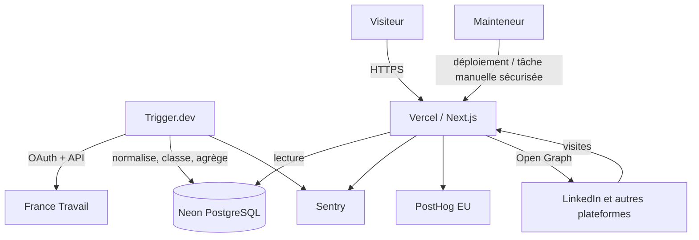
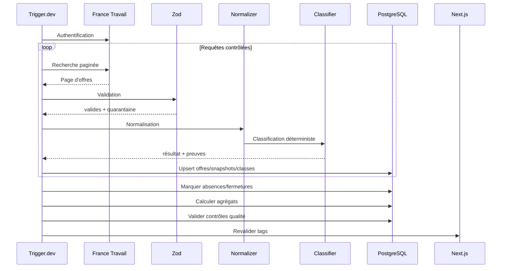

# 01 — Architecture applicative

## 1. Objectifs d'architecture

L'architecture doit optimiser quatre propriétés :

1. **Confiance** — toute donnée affichée est traçable.
2. **Vitesse** — l'utilisateur reçoit du contenu utile sans attendre une application cliente lourde.
3. **Simplicité** — une personne peut comprendre et maintenir le système.
4. **Évolutivité raisonnable** — une deuxième source ou de nouveaux indicateurs peuvent être ajoutés sans réécrire le domaine.

Le système est une application Next.js unique accompagnée de tâches Trigger.dev et d'une base PostgreSQL. Il ne s'agit pas de microservices.

---

## 2. Vue de contexte



---

## 3. Conteneurs logiques

### 3.1 Application web

Responsabilités :

- rendu des pages ;
- parsing et normalisation des filtres URL ;
- lecture des agrégats ;
- lecture paginée des offres ;
- génération des métadonnées ;
- génération des cartes Open Graph ;
- endpoints publics de lecture ;
- endpoint interne de revalidation protégé ;
- instrumentation et sécurité HTTP.

Ne fait pas :

- ingestion complète ;
- classification à la volée d'un grand volume ;
- migration de base ;
- traitement de texte par IA ;
- écriture utilisateur.

### 3.2 Worker Trigger.dev

Responsabilités :

- obtenir et renouveler le jeton source ;
- lancer les requêtes paginées ;
- appliquer le débit autorisé ;
- valider ;
- normaliser ;
- stocker les snapshots ;
- classifier ;
- agréger ;
- détecter les anomalies ;
- déclencher la revalidation ;
- publier logs et métriques.

### 3.3 PostgreSQL

Responsabilités :

- identité et déduplication ;
- source de vérité normalisée ;
- historique ;
- preuve ;
- version de méthode ;
- agrégats ;
- état d'ingestion ;
- incidents de qualité ;
- snapshots d'insight.

### 3.4 Services externes

Ils restent adaptables :

- France Travail : source ;
- Neon : hébergement PostgreSQL ;
- Vercel : exécution web ;
- Trigger.dev : orchestration ;
- Sentry : observabilité ;
- PostHog : analytics.

Le domaine ne doit pas importer leurs SDK directement. Les SDK restent dans `src/lib` ou `trigger/adapters`.

---

## 4. Couches

```text
Presentation
  src/app
  src/components

Application
  src/application/use-cases
  src/application/queries

Domain
  src/domain/offers
  src/domain/classifier
  src/domain/metrics
  src/domain/taxonomy

Infrastructure
  src/db
  src/lib/france-travail
  src/lib/analytics
  src/lib/observability
  trigger
```

### Règle de dépendance

```text
Presentation -> Application -> Domain
Infrastructure -> Domain
Domain -> aucune couche externe
```

Le domaine ne doit importer ni Next.js, ni Drizzle, ni Motion, ni React.

---

## 5. Arborescence détaillée

```text
src/
├── app/
│   ├── (site)/
│   │   ├── layout.tsx
│   │   ├── page.tsx
│   │   ├── explorer/
│   │   ├── insights/[slug]/
│   │   ├── methodologie/
│   │   ├── statut-donnees/
│   │   └── a-propos/
│   ├── api/
│   │   ├── v1/
│   │   │   ├── overview/route.ts
│   │   │   ├── trends/route.ts
│   │   │   ├── offers/route.ts
│   │   │   ├── taxonomies/route.ts
│   │   │   └── data-status/route.ts
│   │   └── internal/
│   │       └── revalidate/route.ts
│   ├── globals.css
│   ├── layout.tsx
│   ├── not-found.tsx
│   ├── error.tsx
│   ├── global-error.tsx
│   ├── robots.ts
│   └── sitemap.ts
├── application/
│   ├── queries/
│   │   ├── get-overview.ts
│   │   ├── get-trends.ts
│   │   ├── get-offers.ts
│   │   └── get-data-status.ts
│   └── use-cases/
│       ├── build-insight.ts
│       └── request-revalidation.ts
├── components/
│   ├── charts/
│   ├── filters/
│   ├── layout/
│   ├── product/
│   └── ui/
├── db/
│   ├── client.ts
│   ├── migrations/
│   ├── queries/
│   └── schema/
├── domain/
│   ├── classifier/
│   │   ├── classify-offer.ts
│   │   ├── evidence.ts
│   │   ├── experience-parser.ts
│   │   ├── junior-rules.ts
│   │   ├── remote-rules.ts
│   │   ├── salary-rules.ts
│   │   └── versions.ts
│   ├── metrics/
│   ├── offers/
│   └── taxonomy/
├── lib/
│   ├── analytics/
│   ├── france-travail/
│   ├── observability/
│   ├── security/
│   └── seo/
├── styles/
│   └── tokens.css
└── tests/
    ├── factories/
    └── fixtures/
```

---

## 6. Server Components et client

### Server Components par défaut

Doivent rester serveur :

- layouts ;
- textes ;
- requêtes PostgreSQL ;
- KPI initial ;
- listes ;
- page méthodologie ;
- statut des données ;
- metadata ;
- construction des datasets de graphiques.

### Client Components limités

Nécessaires pour :

- contrôles de filtre riches ;
- transition d'URL ;
- graphique interactif ;
- drawer de preuve ;
- copie et partage ;
- micro-interactions Motion ;
- mesure analytics client.

### Anti-pattern interdit

```tsx
"use client";

export default function EntireDashboard() {
  // charge toutes les données dans useEffect
}
```

Approche attendue :

```tsx
export default async function DashboardPage({ searchParams }: PageProps) {
  const filters = parseFilters(await searchParams);
  const model = await getOverview(filters);

  return (
    <>
      <DashboardHeader model={model.header} />
      <FilterBar initialFilters={filters} />
      <Suspense fallback={<TrendSkeleton />}>
        <TrendSection filters={filters} />
      </Suspense>
    </>
  );
}
```

Le composant client reçoit uniquement les données nécessaires à son interaction.

---

## 7. Modèle de lecture

Les pages ne recalculent pas des métriques sur toutes les offres à chaque requête.

### Niveau 1 — agrégats pré-calculés

Utilisés pour :

- KPI ;
- tendances ;
- distributions ;
- technologies principales ;
- contrats.

### Niveau 2 — requêtes normalisées

Utilisées pour :

- explorer ;
- preuves ;
- pages d'une offre ;
- contrôles méthodologiques.

### Niveau 3 — calcul ponctuel

Autorisé pour une combinaison rare si :

- requête bornée ;
- index disponible ;
- timeout ;
- mise en cache ;
- métrique identique à la définition de référence.

Les combinaisons populaires peuvent être matérialisées après mesure.

---

## 8. Cache Next.js

### Principes

- données publiques mises à jour après ingestion, pas à chaque seconde ;
- clé de cache basée sur filtres normalisés et version de méthode ;
- tags par ressource ;
- revalidation déclenchée seulement après transaction d'agrégation réussie ;
- ancien contenu conservé si une ingestion échoue.

Tags prévus :

```text
overview
trends
taxonomies
data-status
insight:{slug}
metric:{version}
area:{id}
job:{slug}
tech:{slug}
```

### Séquence de publication

1. ingestion dans une transaction logique ;
2. contrôles qualité ;
3. agrégats terminés ;
4. état de run = `succeeded` ou `partial` accepté ;
5. endpoint interne signé ;
6. revalidation des tags ;
7. smoke test ;
8. statut public mis à jour.

Ne jamais invalider les données publiques avant d'avoir un jeu cohérent.

---

## 9. Adaptateur France Travail

Interface interne :

```ts
export interface JobOfferSource {
  search(params: SourceSearchParams): Promise<SourcePage>;
  getById(id: string): Promise<unknown>;
  getReferenceData(): Promise<SourceReferenceData>;
}
```

Types bruts séparés :

```ts
export type RawSourcePage = unknown;

export type SourcePage = {
  items: RawOfferEnvelope[];
  nextRange: string | null;
  total?: number;
  sourceRequestId?: string;
};
```

### Pourquoi conserver `unknown`

Le SDK ou payload tiers ne doit pas devenir automatiquement un type de confiance. Le schéma Zod transforme `unknown` en type validé.

### Gestion du jeton

- client credentials côté worker ;
- cache mémoire ou mécanisme fourni par le worker pendant un run ;
- renouvellement avant expiration ;
- aucun jeton en base métier ;
- secret masqué ;
- retry unique sur 401 après renouvellement.

### Pagination

L'adaptateur encapsule les détails de plage/pagination. Le reste du domaine ne connaît pas les en-têtes spécifiques de la source.

---

## 10. Pipeline d'ingestion



### Transactions

Une transaction unique pour tout le run peut être trop longue. Utiliser :

- petites transactions par page ;
- run logique avec statut ;
- agrégats écrits avec un `dataset_version` nouveau ;
- bascule atomique du dataset public seulement après validation.

Cette approche évite de publier un mélange ancien/nouveau.

---

## 11. Version de dataset

Table ou clé de publication :

```text
dataset_version = 2026-09-02T03:30:00Z__classifier-1.0.0__queries-1.0.0
```

Les tables d'agrégats portent cette version. Une table `published_datasets` indique la version active.

Avantages :

- rollback rapide ;
- cartes sociales reproductibles ;
- insights figés ;
- pas d'état partiellement recalculé.

---

## 12. Gestion des erreurs

### Erreur source temporaire

- retry exponentiel ;
- conserver l'ancienne version ;
- run `failed` ou `partial` ;
- alerte ;
- pas d'invalidation.

### Offre invalide

- quarantaine ;
- événement de qualité ;
- poursuivre si le seuil reste acceptable ;
- conserver l'empreinte et l'erreur sans exposer le secret.

### Erreur de classification

Le classificateur pur ne doit pas lancer d'exception sur un texte utilisateur. Il retourne `ambiguous` ou `unclassified` et une warning. Une exception indique un bug et bloque la publication si son taux dépasse le seuil.

### Erreur de page publique

- boundary locale ;
- possibilité de retenter ;
- contenu de shell disponible ;
- corrélation Sentry ;
- message sans détail technique.

---

## 13. Contrats et mapping

Chaque étape possède un schéma distinct :

```text
Raw API response
  -> ValidatedSourceOffer
  -> NormalizedOffer
  -> OfferSnapshot
  -> ClassificationResult
  -> MetricInput
  -> PublicViewModel
```

Il est interdit de passer directement le payload source aux composants.

---

## 14. Recherche et filtrage

### MVP

PostgreSQL :

- égalité sur taxonomies ;
- GIN sur tableaux ou relation normalisée ;
- trigramme uniquement si une recherche textuelle libre est ajoutée ;
- pagination par curseur préférée pour grande liste ;
- pagination offset acceptable sur résultats bornés au MVP.

### Pas de moteur externe

Meilisearch ou Elasticsearch ne sont pas nécessaires pour :

- 8 familles ;
- quelques dizaines de technologies ;
- quelques centaines de milliers de snapshots ;
- filtres structurés.

Réévaluer si une recherche full-text publique avec pertinence avancée devient centrale et lente malgré index.

---

## 15. Frontières de sécurité

```text
Internet
  -> Vercel Edge/Node
      -> validation paramètres
      -> application
      -> requêtes préparées Drizzle
          -> PostgreSQL

Trigger.dev
  -> secrets
  -> API France Travail
  -> validation
  -> PostgreSQL

Admin
  -> authentification fournisseur
  -> tâche manuelle autorisée
```

Aucun endpoint public ne doit appeler une tâche coûteuse sans contrôle.

---

## 16. Scalabilité

### Hypothèse initiale

- collecte quotidienne ;
- volume d'offres tech bien inférieur au marché complet ;
- trafic irrégulier provoqué par des posts ;
- lecture très supérieure à l'écriture ;
- données fortement cacheables.

### Réponse

- agrégats ;
- cache ;
- connection pooling ;
- pages serveur ;
- CDN pour actifs ;
- carte OG cacheable ;
- pagination.

### Signaux déclenchant une évolution

| Signal | Évolution possible |
|---|---|
| p95 requêtes agrégées > 500 ms | index, vue matérialisée |
| trop de connexions | pooling/configuration |
| cartes OG saturent | pré-génération / cache |
| recherche libre lente | index FTS puis moteur externe |
| verrou d'ingestion insuffisant | verrou advisory PostgreSQL ou Redis |
| volume analytique massif | entrepôt séparé |
| plusieurs sources avec workers distincts | files dédiées, toujours sans microservices prématurés |

---

## 17. Portabilité

Le projet doit pouvoir quitter un fournisseur :

- SQL PostgreSQL standard ;
- variables d'environnement ;
- adaptateurs ;
- stockage de fichiers non essentiel ;
- aucune logique métier dans une fonction propriétaire ;
- tâches exportables vers un worker Node ;
- export et restauration documentés.

Les optimisations Next.js/Vercel sont acceptées pour le rendu et le cache, à condition que le domaine et les données restent portables.

---

## 18. Décisions à ne pas prendre avant la maquette

- thème sombre ;
- densité exacte ;
- font finale ;
- rayon final ;
- largeur de contenu ;
- nombre précis de colonnes ;
- comportement sticky ;
- visualisation signature.

La maquette décide de ces détails. Les règles d'accessibilité et de performance restent prioritaires.
