# 09 — Déploiement et exploitation

## 1. Objectif

Le produit doit rester fiable avec peu d'administration. L'architecture favorise les services managés, mais exige :

- environnements séparés ;
- déploiements reproductibles ;
- migrations contrôlées ;
- rollback ;
- alertes ;
- sauvegardes ;
- transparence en cas d'incident de données.

---

## 2. Environnements

## Local

- fixtures ;
- base locale Docker optionnelle ou branche Neon dev ;
- MSW pour UI ;
- Trigger.dev dev ;
- aucun indexage ;
- analytics désactivé.

## Preview

- créée par pull request ;
- branche PostgreSQL dédiée ;
- seed synthétique ;
- protégée ;
- `robots: noindex`;
- aucune collecte complète automatique ;
- services externes en environnement test.

## Staging

- domaine privé/non indexé ;
- base séparée ;
- source réelle avec périmètre limité ;
- tâches manuelles ou cron réduit ;
- validation des migrations et cartes sociales.

## Production

- domaine public ;
- données réelles ;
- cron officiel ;
- monitoring ;
- sauvegarde ;
- analytics conforme.

---

## 3. Déploiement web

### Pipeline

```mermaid
flowchart LR
    PR[Pull request] --> CI[Quality CI]
    CI --> Preview[Preview Vercel]
    Preview --> E2E[Playwright + Lighthouse]
    E2E --> Review[Revue]
    Review --> Main[Merge main]
    Main --> Mig[Migration contrôlée]
    Mig --> Deploy[Déploiement production]
    Deploy --> Smoke[Smoke tests]
    Smoke --> Release[Release Sentry]
```



### Règle de migration

Une migration incompatible n'est jamais exécutée avant que le code en production puisse tolérer le nouveau schéma.

### Rollback web

- redeploy du dernier build sain ;
- base compatible avec N et N-1 ;
- feature flag config pour désactiver une section ;
- dataset précédent toujours disponible.

---

## 4. Déploiement Trigger.dev

- config versionnée ;
- tâches liées au commit ;
- secrets par environnement ;
- schedule production seulement ;
- concurrence explicite ;
- machines/durée dimensionnées après mesure ;
- alertes sur échec ;
- tags `run_id`, `dataset_version`, `query_set_version`.

Une nouvelle version du classificateur peut être déployée sans être immédiatement publiée. Elle est d'abord exécutée en comparaison.

---

## 5. Horaire

```text
03:30 Europe/Paris  ingestion principale
après ingestion     classification/agrégats/publication
12:30 Europe/Paris  contrôle léger de disponibilité et cohérence
dimanche 04:30      maintenance/rétention
```

Le timezone IANA doit être explicitement `Europe/Paris` afin de gérer automatiquement heure d'été/hiver.

La date métier d'un run vient du timestamp planifié, pas de l'heure de fin.

---

## 6. Configuration

### Variables web

```text
NEXT_PUBLIC_SITE_URL
DATABASE_URL
DATABASE_DIRECT_URL
REVALIDATION_SECRET
SENTRY_DSN
SENTRY_AUTH_TOKEN
POSTHOG_KEY
POSTHOG_HOST
ANALYTICS_ENABLED
```

### Variables worker

```text
DATABASE_URL
DATABASE_DIRECT_URL
FRANCE_TRAVAIL_CLIENT_ID
FRANCE_TRAVAIL_CLIENT_SECRET
FRANCE_TRAVAIL_TOKEN_URL
FRANCE_TRAVAIL_API_BASE_URL
TRIGGER_SECRET_KEY
REVALIDATION_URL
REVALIDATION_SECRET
INGESTION_REQUESTS_PER_SECOND
```

Les URL source sont configurables afin de suivre le portail officiel, mais validées contre une allowlist en production.

---

## 7. Ingestion quotidienne

### États

```text
queued
running
validating
aggregating
publishing
succeeded
partial
failed
cancelled
```

### Étapes

1. créer run ;
2. acquérir verrou ;
3. charger registre ;
4. authentifier ;
5. requêtes ;
6. validation ;
7. normalisation ;
8. snapshots ;
9. classification ;
10. fermeture ;
11. agrégation ;
12. contrôles qualité ;
13. créer dataset ;
14. publication atomique ;
15. revalidation ;
16. smoke data ;
17. clôture et notification.

### Verrou

Utiliser d'abord un advisory lock PostgreSQL ou la concurrence Trigger.dev. Redis n'est pas nécessaire.

---

## 8. Retry

### Réessayable

- timeout réseau ;
- 429 ;
- 5xx ;
- connexion base temporaire ;
- revalidation réseau.

### Non réessayable automatiquement

- secret invalide répété ;
- schéma source incompatible ;
- violation de contrainte métier ;
- métrique incohérente ;
- migration manquante.

### Backoff

Exponentiel avec jitter, plafond et budget total. Respecter `Retry-After`.

---

## 9. Idempotence

Clé logique :

```text
source + business_date + query_set_version + mode
```

Un run forcé peut avoir un `attempt`, mais ses upserts ne dupliquent pas offres/snapshots.

Les agrégats écrits sous un nouveau `dataset_version` sont remplaçables avant publication, immuables après.

---

## 10. Observabilité

### Logs

Événements :

```text
ingestion_started
source_page_received
source_rate_limited
validation_summary
snapshot_summary
classification_summary
quality_gate_failed
dataset_published
revalidation_completed
ingestion_finished
```

### Métriques

```text
run_duration_seconds
source_requests_total
source_errors_total
offers_received
offers_new
offers_updated
offers_quarantined
classification_ambiguous_ratio
junior_claim_ratio
dataset_age_hours
api_latency
page_5xx_ratio
og_generation_latency
```

### Traces

Une trace par run, spans par requête/lot, sans payload sensible.

---

## 11. Alertes

| Alerte | Seuil initial |
|---|---|
| échec ingestion | immédiat |
| pas de succès | 30 h |
| données > 72 h | critique produit |
| validation < 98 % | warning |
| validation < 95 % | blocage publication |
| volume global -40 % | warning/revue |
| volume partition -60 % | warning |
| ambiguïté ×2 | warning |
| durée > 2× médiane 7j | warning |
| 5xx web | seuil Sentry |
| Core Web Vitals | dégradation p75 |
| base proche limite | seuil fournisseur |

Canal minimal : e-mail. Ajouter Slack/Discord uniquement si réellement utilisé.

---

## 12. Page de statut interne et publique

### Public

- fraîcheur ;
- dernier run ;
- volumes synthétiques ;
- incident ;
- version.

### Interne

Fournisseurs et dashboards :

- erreur détaillée ;
- requête ;
- page ;
- stack ;
- coût ;
- secret redacted.

Ne pas construire une console interne dans le produit au MVP.

---

## 13. Incident de données

### Détection avant publication

Ne pas publier ; garder version précédente.

### Détection après publication

1. désactiver les cartes sociales automatiques concernées ;
2. rollback du dataset ;
3. bannière si impact important ;
4. corriger ;
5. publier un changelog ;
6. recalculer insights.

Un dataset est rollbackable indépendamment du code.

---

## 14. Sauvegarde et restauration

### Avant lancement

- sauvegarde managée vérifiée ;
- export SQL ;
- restauration dans une base distincte ;
- comparaison des comptes ;
- test d'application ;
- documentation du temps.

### Récurrent

- test trimestriel ;
- export taxonomies/insights ;
- surveillance des échecs ;
- secret de restauration protégé.

---

## 15. Coûts

Suivre mensuellement :

```text
Vercel
Neon
Trigger.dev
Sentry
PostHog
domaine
stockage/logs
```

Garde-fous :

- limites fournisseur ;
- alertes budget ;
- échantillonnage traces ;
- pas de replay ;
- cache ;
- cartes OG cacheables ;
- previews expirées ;
- branches de base nettoyées.

Le projet n'étant pas monétisé, la maîtrise des coûts fait partie de la qualité.

---

## 16. Domaine et DNS

- domaine court ;
- HTTPS ;
- redirection `www` ou apex cohérente ;
- canonical unique ;
- SPF/DKIM uniquement si e-mails ;
- monitoring d'expiration ;
- renouvellement automatique ;
- accès au registrar protégé par MFA.

---

## 17. Smoke tests production

Après déploiement :

- `/` 200 et KPI ;
- `/explorer` ;
- `/methodologie` ;
- `/statut-donnees` ;
- `/api/v1/overview` validé ;
- OG d'un insight ;
- headers ;
- canonical ;
- base ;
- Sentry release ;
- aucun `noindex` accidentel.

En cas d'échec P0, rollback.

---

## 18. Runbook — données périmées

1. vérifier dernier run ;
2. vérifier source et authentification ;
3. vérifier base ;
4. relancer uniquement si cause temporaire ;
5. ne pas publier si quality gate échoue ;
6. afficher statut ;
7. corriger ;
8. publier ;
9. vérifier cartes et cache ;
10. fermer incident.

---

## 19. Runbook — quota source

1. arrêter concurrence inutile ;
2. vérifier boucle/pagination ;
3. respecter `Retry-After` ;
4. réduire débit ;
5. reprendre depuis checkpoint ;
6. ne pas contourner avec plusieurs credentials ;
7. documenter.

---

## 20. Runbook — rollback dataset

1. identifier dernière version saine ;
2. basculer `is_current` atomiquement ;
3. revalider tags ;
4. smoke test ;
5. marquer version défaillante ;
6. publier incident si visible ;
7. corriger et recalculer.

---

## 21. Checklist release

### Tâches de maintenance implémentées

`check-data-health` contrôle la base à 12:30 Europe/Paris et est déclenché après succès ou
échec terminal de la collecte. Il vérifie fraîcheur, validation et complétude, puis compare le
volume et l'ambiguïté entre datasets figés de mêmes versions de requêtes et classificateur.
La durée n'est comparée à la médiane qu'avec sept journées antérieures distinctes disponibles.
Un changement de périmètre ne produit donc pas une fausse anomalie temporelle.

Les incidents de données sont ouverts/résolus dans `data_quality_events` avec messages fixes,
sans offre ni secret. Un incident déjà ouvert n'est pas dupliqué. Le contrôle ne se base pas sur
son propre incident pour décider du rétablissement. Le dépassement de durée reste interne.
L'échec final de la tâche est le signal pour les alertes natives Trigger.dev ; la présence du
code ne prouve pas l'abonnement e-mail ni la réception effective d'une notification.

`maintain-data-retention` s'exécute le dimanche à 04:30 Europe/Paris dans une file séparée.
Chaque lot efface au plus 500 charges brutes arrivées à l'échéance déjà enregistrée et 500
diagnostics de quarantaine de plus de 30 jours, seulement sur des collectes terminées.
Les verrous `SKIP LOCKED` évitent d'attendre une ligne occupée. Un audit agrégé est écrit dans
la même instruction SQL. Aucun snapshot, preuve, métrique ni appartenance au dataset n'est
supprimé. L'exécution est bornée à 100 lots et échoue s'il reste des données éligibles : relancer
la tâche après diagnostic, sans modifier les échéances pour faire disparaître l'alerte.

Les journaux gérés par les fournisseurs ne sont pas stockés dans ces tables : leur rétention
doit être contrôlée chez chaque fournisseur, pas simulée par une purge locale.

### Exercice de notification

Le canal Trigger.dev de production doit être activé pour les échecs de tâches et de déploiements,
avec le compte du mainteneur comme destinataire. Les succès ne sont pas envoyés par e-mail.
La configuration suit les [alertes natives documentées](https://trigger.dev/docs/troubleshooting-alerts).

`verify-alert-delivery` est une tâche manuelle sans cron, sans connexion base ni appel source.
Son payload `{ "confirmation": "SEND_IDENTIFIED_TEST_ALERT" }` produit volontairement un échec
terminal `TEST_ALERTE_JUNIOR_VRAIMENT`, sans réessai. Sans cette confirmation, aucun échec de
test n'est produit. Vérifier ensuite le run **et** la réception du message dans la boîte du
destinataire. Un run échoué confirme le signal, pas la livraison de l'e-mail. Ne pas provoquer
une panne de la vraie ingestion ni modifier un dataset pour tester les notifications.

Pour tester la purge et les incidents, créer une branche Neon jetable avec une copie contrôlée,
configurer uniquement sa connexion dans `ROLLBACK_GAME_DAY_DATABASE_URL`, puis exécuter :

```powershell
$env:RUN_DATASET_ROLLBACK_GAME_DAY = '1'
pnpm exec vitest run src/db/maintenance.live.test.ts
```

Ne jamais utiliser la connexion de production pour ce test : il modifie les échéances de deux
charges brutes et injecte un diagnostic de test. La tâche normale ne fait pas ces modifications.

### Portes de release

- [ ] migrations compatibles ;
- [ ] secrets présents ;
- [ ] schedule correct ;
- [ ] CI verte ;
- [ ] E2E ;
- [ ] Lighthouse ;
- [ ] source maps ;
- [ ] version Sentry ;
- [ ] dataset sain ;
- [ ] backup ;
- [ ] rollback connu ;
- [ ] statut opérationnel ;
- [ ] robots/canonical corrects.
