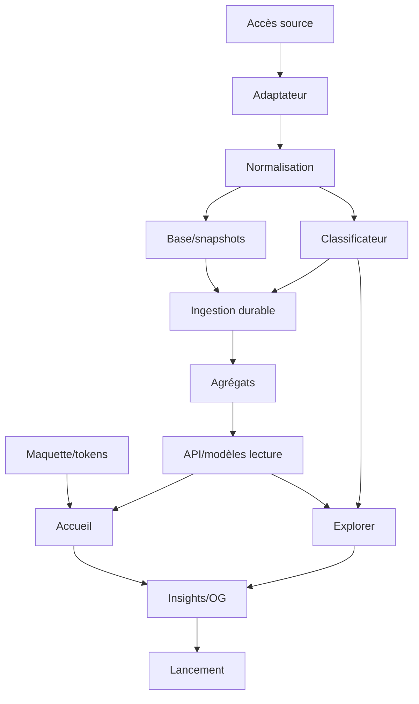

# 11 — Plan d'implémentation

## 1. Principe

Construire dans l'ordre du risque :

1. accès et compréhension de la source ;
2. modèle et classification ;
3. crédibilité des métriques ;
4. design system issu de la maquette ;
5. expérience publique ;
6. partage ;
7. exploitation.

Ne pas commencer par une animation de landing page avant d'avoir prouvé que le dataset et le KPI sont calculables.

---

## 2. Lots

## Lot 0 — Cadrage et accès

### Livrables

- dépôt ;
- licence choisie ;
- accès France Travail ;
- conditions archivées ;
- variables ;
- première réponse API conservée en fixture redacted ;
- registre initial de requêtes ;
- `/maquette` inventorié ;
- backlog.

### Sortie

Une commande locale peut récupérer une page dans un environnement contrôlé et la valider.

---

## Lot 1 — Bootstrap qualité

### Tâches

- Next.js 16.3 ;
- React 19.2.7 ;
- TypeScript 7 strict ;
- Tailwind 4.3 ;
- pnpm ;
- ESLint/Prettier ;
- Vitest ;
- Playwright ;
- Storybook ;
- MSW ;
- Sentry désactivable ;
- CI.

### Sortie

Une page minimale se build, Storybook se build et la CI passe.

---

## Lot 2 — Maquette et design system

### Tâches

- inventaire ;
- tokens ;
- typographie ;
- grille ;
- composants shadcn ;
- stories ;
- états ;
- motion tokens ;
- comparaison captures.

### Livrables

```text
tokens.css
foundations stories
Button
Card
Badge
Select
Command
Dialog/Drawer
Skeleton
DataFreshnessBadge
MetricCard
```

### Sortie

Le shell et les composants clés ressemblent à la maquette sans données réelles.

---

## Lot 3 — Base de données

### Tâches

- Neon ;
- Drizzle ;
- schéma ;
- migrations ;
- seeds ;
- rôles ;
- connexion poolée ;
- tests d'intégration ;
- dataset publication.

### Sortie

Les scénarios offre inchangée/modifiée et bascule dataset passent.

---

## Lot 4 — Adaptateur France Travail

### Tâches

- OAuth ;
- recherche ;
- pagination ;
- débit ;
- retries ;
- validation ;
- mapping ;
- fixtures ;
- quarantaine ;
- registre de requêtes.

### Sortie

Une collecte limitée produit des offres normalisées avec rapport qualité.

---

## Lot 5 — Classificateur

### Sous-lots

1. normalisation texte ;
2. junior ;
3. expérience ;
4. salaire ;
5. remote ;
6. technologies ;
7. conflits ;
8. preuves ;
9. version ;
10. gold set.

### Sortie

Seuils de précision atteints sur validation et rapport de delta disponible.

---

## Lot 6 — Ingestion durable

### Tâches

- Trigger.dev ;
- cron ;
- concurrence ;
- idempotence ;
- checkpoints ;
- runs ;
- fermeture ;
- agrégats ;
- quality gate ;
- publication ;
- revalidation ;
- alertes.

### Sortie

Sept runs quotidiens successifs avant lancement.

---

## Lot 7 — Modèles de lecture

### Tâches

- parsing des filtres ;
- requêtes overview ;
- trends ;
- explorer ;
- status ;
- cache tags ;
- API ;
- OpenAPI ;
- tests de performance.

### Sortie

Les réponses de fixtures respectent les contrats et les budgets.

---

## Lot 8 — Accueil

### Ordre

1. shell ;
2. hero KPI ;
3. filtre ;
4. tendance ;
5. expérience ;
6. salaire ;
7. contrats ;
8. technologies ;
9. exemples ;
10. méthode ;
11. footer.

### Sortie

Parcours accueil complet sur trois viewports, clavier et reduced motion.

---

## Lot 9 — Explorer et preuve

### Tâches

- table desktop ;
- cartes mobile ;
- pagination ;
- tri ;
- drawer/dialog ;
- extraits ;
- source ;
- URL ;
- états.

### Sortie

Tout KPI peut être relié à une liste et chaque offre à ses preuves.

---

## Lot 10 — Pages de confiance

- méthodologie ;
- à propos ;
- statut ;
- limites ;
- changelog ;
- signalement.

### Sortie

Une personne externe peut expliquer comment le chiffre a été produit.

---

## Lot 11 — Insights et partage

- modèle insight ;
- route ;
- metadata ;
- ImageResponse ;
- aperçu ;
- copier ;
- Web Share ;
- LinkedIn ;
- analytics ;
- correction.

### Sortie

Trois cartes réelles testées.

---

## Lot 12 — Hardening et lancement

- sécurité ;
- headers ;
- performance ;
- accessibilité manuelle ;
- restauration ;
- game day ;
- SEO ;
- analytics ;
- coûts ;
- contenu de lancement ;
- checklist.

---

## 3. Backlog par priorité

### P0

```text
DATA-001 accès source
DATA-002 validation
DATA-003 normalisation
DATA-004 snapshots
CLASS-001 junior
CLASS-002 expérience
CLASS-003 preuves
METRIC-001 KPI principal
UI-001 tokens maquette
UI-002 hero
UI-003 filtres
EXP-001 explorer
TRUST-001 méthodologie
OPS-001 ingestion
OPS-002 publication dataset
SHARE-001 OG
QUALITY-001 gold set
QUALITY-002 E2E
```

### P1

```text
salary
remote
technologies
trend 90d
status détaillé
insights multiples
SEO ville/tech
rapport mensuel
```

### P2

```text
comparateur
export agrégé
deuxième source
API publique formalisée
widget
newsletter
```

---

## 4. Dépendances



---

## 5. Découpage des pull requests

Les PR doivent rester revues facilement.

Exemples :

```text
chore/bootstrap-next-quality
feat/design-tokens
feat/db-offer-snapshots
feat/france-travail-client
feat/classifier-junior-signals
feat/classifier-experience
feat/ingestion-daily
feat/metrics-contradiction
feat/home-kpi
feat/filter-url-state
feat/explorer-evidence
feat/methodology
feat/insight-og
chore/launch-hardening
```

Ne pas livrer « toute l'application » dans une seule PR.

---

## 6. Stratégie de données avant UI finale

Créer un notebook/script d'analyse ponctuel uniquement pour valider :

- volumes ;
- taux ;
- cas inconnus ;
- requêtes ;
- distribution ;
- qualité.

Le script ne devient pas une deuxième source de vérité. Les formules finales vivent dans le domaine testé.

Avant de dessiner tous les graphiques, obtenir une semaine de données afin de connaître les distributions réelles.

---

## 7. Ordre d'intégration de la maquette

1. lire `maquette/README.md` ;
2. créer inventaire ;
3. relever tailles et variantes ;
4. identifier composants ;
5. traduire en tokens ;
6. construire fondations ;
7. composer page statique ;
8. ajouter données ;
9. ajouter motion ;
10. faire revue pixel/UX ;
11. ajuster responsive manquant ;
12. figer baseline visuelle.

Ne pas coder l'animation avant d'avoir un layout stable.

---

## 8. Milestones

### M1 — Données prouvées

- accès ;
- échantillon ;
- classificateur initial ;
- premier KPI local ;
- preuve.

### M2 — Pipeline fiable

- base ;
- Trigger ;
- historique ;
- agrégats ;
- publication.

### M3 — Produit utilisable

- accueil ;
- filtre ;
- explorer ;
- méthode.

### M4 — Produit partageable

- insight ;
- OG ;
- SEO ;
- analytics.

### M5 — Produit lançable

- sept jours ;
- qualité ;
- sécurité ;
- a11y ;
- performance ;
- operations.

---

## 9. Définition du MVP strict

Le MVP est :

- une source ;
- huit familles ;
- technologies prioritaires ;
- France + filtres géographiques ;
- un KPI central ;
- quatre à sept métriques secondaires ;
- explorer ;
- méthode ;
- statut ;
- insights ;
- partage.

Toute fonctionnalité qui ne renforce ni compréhension, ni preuve, ni partage est repoussée.

---

## 10. Critères de passage

### M1 → M2

- au moins 200 fixtures ;
- preuves ;
- précision seuil ;
- mapping source documenté.

### M2 → M3

- ingestion idempotente ;
- dataset atomique ;
- rollback ;
- status ;
- requêtes performantes.

### M3 → M4

- tests utilisateurs ;
- responsive ;
- clavier ;
- maquette ;
- aucune dette bloquante.

### M4 → M5

- cartes testées ;
- metadata ;
- analytics ;
- politique ;
- observabilité.

---

## 11. Risques de planning

### Accès API

Commencer immédiatement. En parallèle, développer avec fixtures contractuelles.

### Maquette incomplète

Ne pas inventer silencieusement. Créer des règles responsive cohérentes et documenter les écarts.

### Classification plus difficile que prévu

Réduire le périmètre et publier davantage de cas `ambiguous`, jamais baisser le niveau de preuve pour tenir une date.

### Trop peu de volume local

L'accueil reste France. Les vues locales utilisent seuil et élargissement.

### Effets visuels coûteux

Conserver la hiérarchie et réduire le mouvement. Le produit premium est d'abord rapide.

---

## 12. Dette interdite au lancement

- secret dans code ;
- classification non versionnée ;
- chiffre sans dénominateur ;
- pas de rollback ;
- pas d'état partiel ;
- composant inaccessible ;
- page mobile cassée ;
- animation ignorante de reduced motion ;
- erreur silencieuse ;
- source non attribuée ;
- migration non testée ;
- dépendance inutile pour contourner un problème compris.

---

## 13. Après lancement

### 7 jours

- erreurs ;
- filtres utilisés ;
- compréhension ;
- coût ;
- source ;
- retours.

### 30 jours

- rapport mensuel ;
- qualité ;
- tendance ;
- SEO ;
- partages ;
- corrections ;
- décision P1.

### 90 jours

- pertinence d'une deuxième source ;
- pages programmatiques ;
- comparateur ;
- API/export ;
- coûts et architecture ;
- éventuel passage pnpm 12 si non déjà effectué.

---

## 14. Estimation relative

Utiliser des tailles, pas une fausse précision horaire :

| Lot | Taille |
|---|---|
| Bootstrap | S |
| Design system | M |
| Base | M |
| Adaptateur | M |
| Classificateur | XL |
| Worker | L |
| Modèles lecture | M |
| Accueil | L |
| Explorer | L |
| Confiance | M |
| Partage | M |
| Hardening | L |

Le classificateur et la qualité des données sont le chemin critique.
